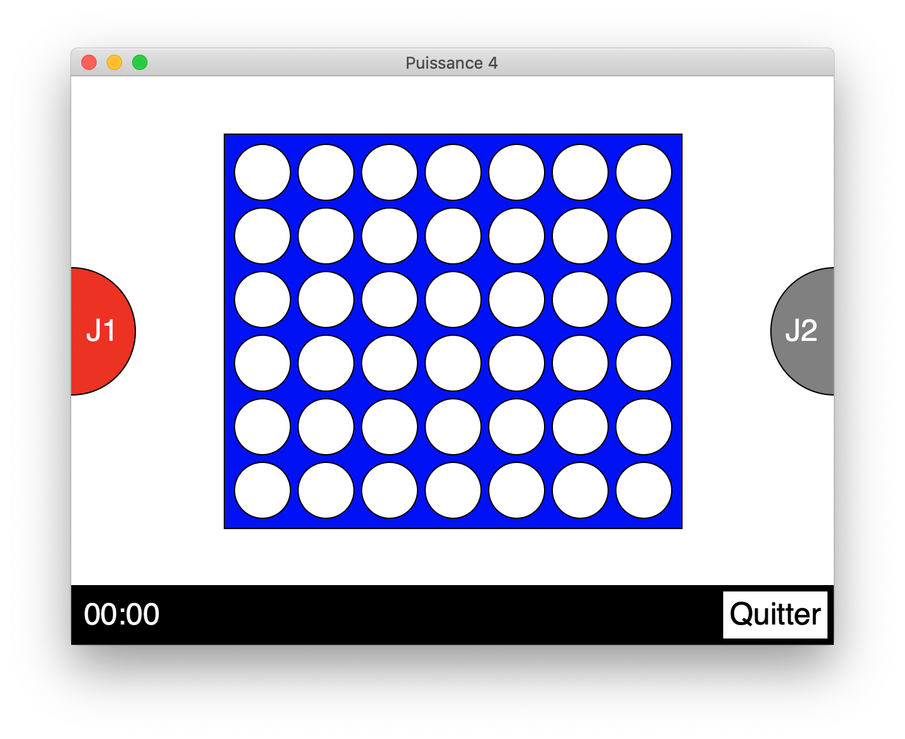
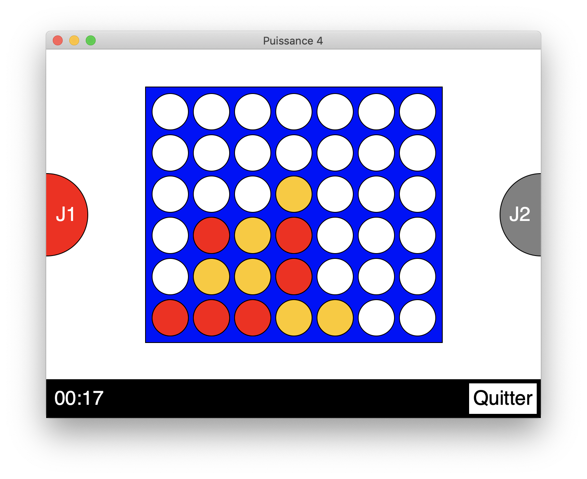
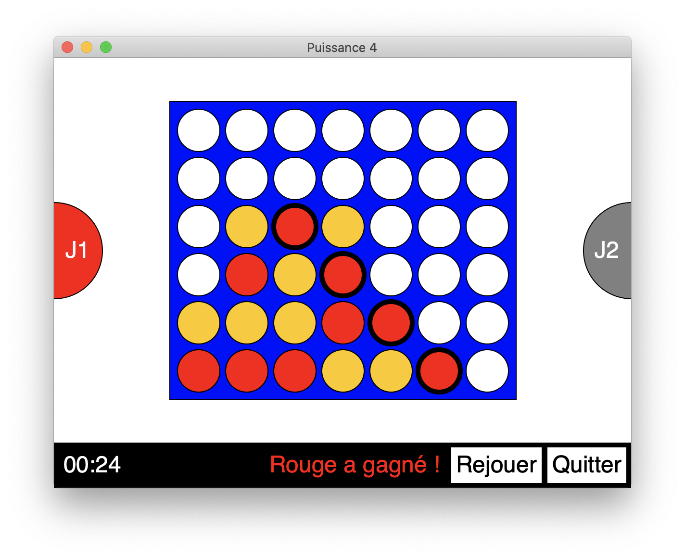

# Connect 4

This game is written in Python using the `upemtk` library from the University of Marne-la-Vallée in France.

## Rules

The goal is to align 4 pawns in any direction.  
To do so, you have to click columns where you want to add a pawn.

## Screenshots

